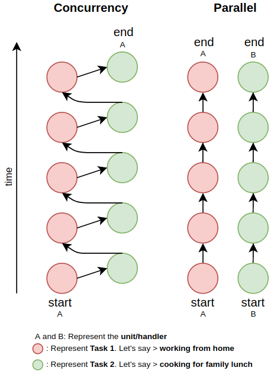

# Parallelism and Concurrency

## Definition

**Concurrency**: Dealing with lots of things at once with single resource/handler/unit

**Parallelism**: Doing lots of things at once with multiple resources/handlers/units

## Diagram

## Analogy

