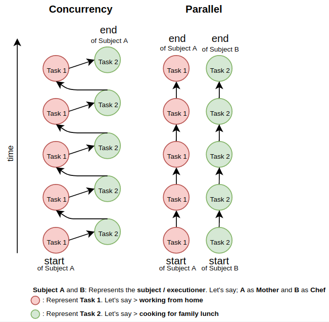

# Parallelism and Concurrency

## Definition

**Concurrency**: Dealing with lots of things at once with single executioner / subject / handler

**Parallelism**: Doing lots of things at once (at the same time) with multiple executioners / subjects / handlers

## Diagram

## Analogy

So let's say someone / subject / executioner has responsible for doing some task in several amount of time. From the diagram above as an example. we could say the **Mother** as **Subject A** and **Chef** as **Subject B**.

1. In the **Concurrency** terms: We have only one executioner. **Mother** as an executioner / subject has to **Working** and then also **Cooking** for the lunch one by one in turn. So in this kind of process; <ins>one executioner responsible for multiple task at the time.</ins>

2. In the **Parallel** terms: We have multiple executioner. **Mother** doesn't need to be worry about **Cooking** and could be focus with her **Working** while the **Chef** is **Cooking** for the lunch. So in this kind of process; <ins>one executioner responsible for only one task at the time.</ins>
